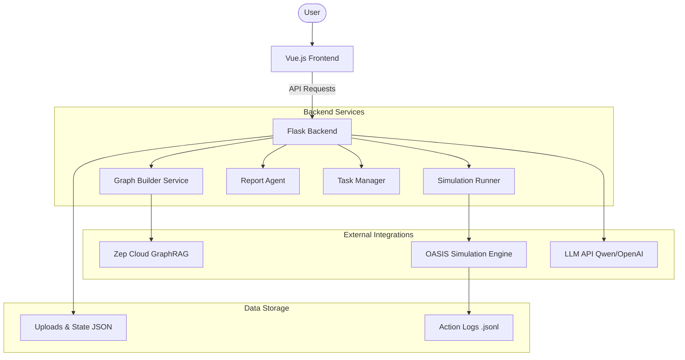

# MiroFish Technical Overview

**MiroFish** is a next-generation swarm intelligence engine powered by multi-agent technology. It enables users to upload seed information (documents, reports, or stories) and simulate a high-fidelity parallel digital world to predict future trajectories and societal evolution.

---

## 🏗 System Architecture

MiroFish follows a modern client-server architecture with a clear separation between the reactive frontend and the simulation-heavy backend.

---

## 🛠 Core Components

### 1. Backend (Python/Flask)
The backend is built using **Flask** (Application Factory pattern) and serves as the orchestration layer for simulations and knowledge extraction.

- **Simulation Runner (`SimulationRunner`)**: Manages long-running simulation processes. It uses `subprocess` to launch parallel environments for Twitter and Reddit sandboxes and monitors real-time `actions.jsonl` logs to provide status updates to the frontend via polling.
- **Graph Builder (`GraphBuilderService`)**: Integrates with **Zep Cloud** to implement **GraphRAG**. It dynamically generates ontologies (entities and relationships) from source text using LLMs and builds a queryable knowledge graph.
- **Report Agent (`ReportAgent`)**: A specialized agent that analyzes simulation results and interacts with the knowledge graph to generate comprehensive prediction reports.
- **OASIS Integration**: MiroFish leverages the [OASIS](https://github.com/camel-ai/oasis) engine for social interaction simulations, including agent behavior logic and platform mechanics.

### 2. Frontend (Vue 3/Vite)
The frontend is a **Vue 3** Single Page Application designed for complex workflow management and real-time visualization.

- **Workflow Orchestration (`Process.vue`)**: Implements a multi-step project lifecycle:
    1.  **Ontology Generation**: Analyzing uploaded docs to define the "rules" of the world.
    2.  **Graph Construction**: Reconstructing the knowledge network.
    3.  **Environment Setup**: Configuring agent personas and simulation parameters.
    4.  **Simulation Execution**: Running and monitoring the swarm interaction.
- **Data Visualization**: Uses **D3.js** for real-time network graph rendering, allowing users to explore entities and relationships as they are discovered or updated.
- **Real-time Monitoring**: Employs a robust polling mechanism to synchronize backend task statuses and simulation logs with the UI.

---

## 🔄 End-to-End Workflow

1.  **Seed Extraction**: User uploads raw text/PDFs. The system uses an LLM to identify key entities and relationship types (Ontology).
2.  **GraphRAG Construction**: The source text is chunked and indexed into Zep Cloud. A standalone knowledge graph is built to represent the initial state of the world.
3.  **Digital Sandbox Setup**: Based on the graph, the system generates "personas" for hundreds of agents, reflecting the personalities and motivations found in the seed material.
4.  **Simulation & Social Evolution**: Agents are deployed into a parallel digital world (Twitter/Reddit clones). They interact, post, like, and share information, leading to "emergent" collective behaviors.
5.  **Prediction Reporting**: The ReportAgent analyzes the simulation timeline and graph changes to produce a structured prediction report.

---

## 🚀 Key Technologies

| Category | Technology |
| :--- | :--- |
| **Backend** | Flask, Pydantic, Subprocess, Python 3.11+ |
| **Frontend** | Vue 3, Vite, D3.js, Pinia |
| **Simulation** | OASIS Engine |
| **Memory/Graph** | Zep Cloud (GraphRAG) |
| **Intelligence** | LLM API (OpenAI Compatible, Qwen-plus) |
| **Deployment** | Docker, Docker-Compose, uv (Python) |
